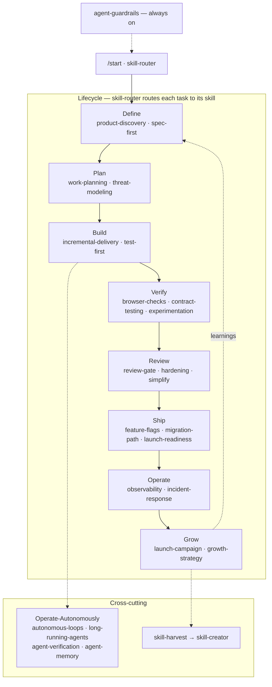
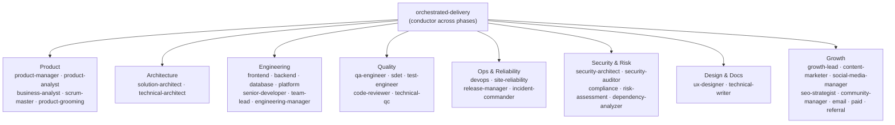

# engineering-skills

[](https://github.com/vindreshsingh/engineering-skills/actions/workflows/validate.yml)
[](LICENSE)


**Turn your AI coding agent into a disciplined engineering team.** A reusable, agent-agnostic library
of **64 production-grade engineering skills** — each a step-by-step process with verification, not
reference docs — plus a **40-role SDLC & marketing org** and an **orchestrated build loop** that
conducts a feature end to end.

Works with **Claude Code, Cursor, Gemini CLI, GitHub Copilot, and Codex / OpenCode**. Install once, use
in any repo.

## How it compares

Most skill libraries are either narrow (the dev loop only) or unproven advice. This one is different on
two axes:

- **Breadth** — the full lifecycle *plus* a 40-persona org (PM, architect, DBA, QA, SRE, release… and a
  marketing team), orchestrated by `orchestrated-delivery`.
- **Rigor** — skills are **behaviorally tested**: **every** process skill has a pressure-scenario test
  that proves the skill changes what the agent does, enforced in CI.

It's new — competing on scope and rigor, not adoption. Honest feedback and PRs welcome.

**See it work:** [a feature shipped end-to-end by the 40-role org](docs/launch/demo-walkthrough.md)
(`/deliver Add product reviews`).

## Install (Claude Code plugin — use in any repo)

From inside any project, in an interactive `claude` session:

```text
/plugin marketplace add vindreshsingh/engineering-skills
/plugin install engineering-skills@engineering-skills
```

Or wire it into a project declaratively in `.claude/settings.json`:

```json
{
  "extraKnownMarketplaces": {
    "engineering-skills": {
      "source": { "source": "github", "repo": "vindreshsingh/engineering-skills" }
    }
  },
  "enabledPlugins": {
    "engineering-skills@engineering-skills": true
  }
}
```

This makes all **64 skills**, **38 agents** (30 SDLC + 8 marketing), and session hooks available in
that project. See [docs/plugin-discovery.md](docs/plugin-discovery.md) for load paths.

## Start here (first 5 minutes)

64 skills is a lot — you don't pick from all of them. Get going fast:

1. **Run `/start`** in any repo. It detects your stack and recommends the *3–5 skills and the workflow*
   that fit this project — not the whole catalog.
2. **Set a profile** to scope the emphasis to your kind of work — `frontend`, `backend`, `full-stack`,
   or `solo-founder` ([profiles/](profiles/README.md)):
   ```bash
   echo full-stack > .engineering-skills-profile
   ```
3. **Browse the [live explorer](https://vindreshsingh.github.io/engineering-skills/)** when you want to
   see everything and copy a ready-to-paste prompt.

**See the lift in code:** [before / after examples](docs/examples/README.md) — the same task done
without a skill vs with it.

## Use with any other agent

**Works with** Claude Code, Gemini CLI, Cursor, GitHub Copilot, and any AGENTS.md-aware tool (Codex,
OpenCode, Factory…) — the repo ships the entry-point file each one reads, all pointing at the same
skills.

Skills are plain Markdown. Clone the repo and point your agent at `skills/<name>/SKILL.md`:

```bash
git clone https://github.com/vindreshsingh/engineering-skills.git
```

Per-tool install and usage: [`docs/platforms.md`](docs/platforms.md). General guide:
[`docs/getting-started.md`](docs/getting-started.md).

## How it works

Every task enters through `skill-router` (or `/start`), which routes it to the one skill that governs
that step — then chains to the next phase. `agent-guardrails` is always on; `skill-harvest` feeds
lessons back so the library compounds.



The bookends — `product-discovery` (`/discover`) and `launch-campaign` (`/launch`) — wrap the code loop
into a full **discover → build → launch** arc.

## Skills by phase

| Phase   | Skills |
|---------|--------|
| Define  | `product-discovery`, `idea-shaping`, `product-brief`, `spec-first` |
| Plan    | `work-planning`, `product-grooming`, `threat-modeling` |
| Build   | `incremental-delivery`, `test-first`, `context-curation`, `source-first`, `ui-craft`, `micro-interactions`, `ux-design`, `accessibility`, `react-patterns`, `mobile-patterns`, `i18n-l10n`, `interface-design`, `design-handoff`, `resilience`, `data-modeling`, `caching-strategy`, `llm-feature-engineering` |
| Verify  | `browser-checks`, `e2e-testing`, `contract-testing`, `fault-recovery`, `experimentation` |
| Review  | `review-gate`, `simplify`, `hardening`, `perf-budget`, `dependency-hygiene`, `version-upgrade` |
| Ship    | `git-flow`, `pipeline-ops`, `feature-flags`, `migration-path`, `decision-docs`, `technical-writing`, `launch-readiness` |
| Operate | `observability`, `incident-response`, `finops-budget` |
| Grow    | `launch-campaign` (conductor), `growth-strategy`, `content-marketing`, `social-distribution`, `seo-growth`, `community-engagement`, `paid-ads`, `email-nurture`, `referral-loop` — under `skills/marketing/`, see [marketing/README.md](marketing/README.md) |
| Operate autonomously | `autonomous-loops` (conductor), `long-running-agents`, `agent-verification`, `agent-memory` |
| Meta    | `agent-guardrails` (always on), `skill-router`, `skill-creator`, `skill-harvest`, `orchestrated-delivery`, `parallel-subagents` |

See [SKILLS.md](SKILLS.md) for the full auto-generated catalog. **End-to-end example:**
[docs/sdlc-walkthrough.md](docs/sdlc-walkthrough.md).

## Explore

A self-contained Agent & Skill Explorer — browse every skill and agent grouped by lifecycle phase,
search, and copy a ready-to-paste Claude Code prompt (optionally scoped to a repo/task).

**Live:** [vindreshsingh.github.io/engineering-skills](https://vindreshsingh.github.io/engineering-skills/)
(auto-published from `main`). Or run it locally:

```bash
python3 scripts/generate-explorer.py          # regenerate explorer/index.html from frontmatter
python3 -m http.server 8000 --directory explorer   # then open http://localhost:8000
```

It's a **storefront, not a runtime**: the copied prompt runs in Claude Code, under its permissions and
this repo's `agent-guardrails`. The page is generated from the same `SKILL.md` / agent frontmatter as
the catalog, so it never drifts.

## Agent personas

Three general reviewer personas:

- `code-reviewer` — five-dimension review (correctness, readability, architecture, security, performance)
- `security-auditor` — vulnerability detection, threat modeling, secure-coding review
- `test-engineer` — test strategy, test writing, coverage analysis

Plus a full **30-role SDLC org** and an **8-role growth team** for marketing — positioning, content,
social, SEO, and community. `orchestrated-delivery` conducts them across the lifecycle, dispatching
independent work to parallel subagents. See [docs/agent-org.md](docs/agent-org.md) for the full org map.



Each persona loads its primary skill and runs that skill's process — the agent is *who*, the skill is
*how*.

## Repository layout

```
skills/           → Engineering skills (marketing under skills/marketing/)
agents/sdlc/      → SDLC personas (30 agents)
agents/marketing/ → Growth team (8 agents)
marketing/        → Marketing team guide, router, references
hooks/            → Session lifecycle hooks (skill router auto-loaded on session start)
references/       → Engineering checklists (testing, performance, security, accessibility, + phase checklists)
docs/             → Per-tool setup guides
.claude-plugin/   → Plugin + marketplace manifests
```

## Marketing team

A separate **Growth & Marketing** team for post-launch growth — grouped under `marketing/`:

- [marketing/README.md](marketing/README.md) — team guide and flow
- [agents/marketing/](agents/marketing/) — 5 agents (growth-lead, content-marketer, etc.)
- [skills/marketing/](skills/marketing/) — 5 skills (growth-strategy, content-marketing, etc.)
- [prompts/agents/marketing/](prompts/agents/marketing/) — copy-paste prompts

## SDLC team

- [agents/sdlc/README.md](agents/sdlc/README.md) — 30 agents including `ux-designer`, `technical-writer`

## Authoring new skills

Follow [`docs/skill-anatomy.md`](docs/skill-anatomy.md). Every skill needs YAML frontmatter with
`name` + `description`, and the sections: Overview, When to Use, Process, Common Rationalizations,
Red Flags, Verification.

## License

MIT — see [LICENSE](LICENSE).
