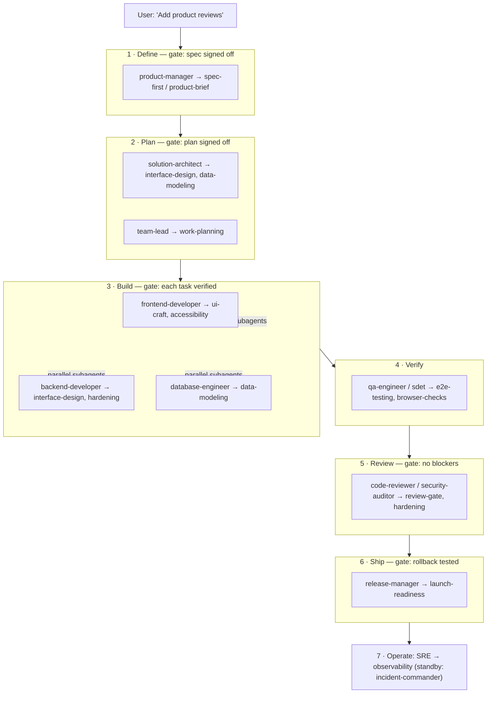

# Demo: shipping "Add Product Reviews" with the org

This is the differentiator made concrete. One request — *"Add product reviews"* — driven end to end by
`orchestrated-delivery` conducting the 40-role org. Each phase shows the **persona**, the **skill it
runs**, the **gate** it must clear, and a sample of what it produces. This is what "an engineering team
in a repo" actually looks like in a session.

## The flow



## Phase by phase

### 1 · Define — `product-manager` runs [spec-first]
Instead of coding, it writes a one-page spec:
- **Goal:** logged-in buyers can rate (1–5) and review products; everyone sees reviews + average.
- **Acceptance:** one review per user per product; edit within 24h; profanity flagged; paginated.
- **Out of scope (v1):** images, helpfulness votes, seller replies.
- **Gate:** ⏸ *stops for your sign-off before planning.*

### 2 · Plan — `solution-architect` + `team-lead`
- Architect defines the `reviews` service boundary, the API contract, and the schema shape.
- `team-lead` runs [work-planning] into a dependency-ordered, multi-discipline plan and flags what's
  parallelizable:
  ```
  1. DB: reviews table (+ unique user/product, index by product)   [blocks 2,3]
  2. API: POST /reviews, GET /products/:id/reviews (auth, validate) [blocks 4]
  3. Seed script update                                            [independent]
  4. FE: review form + list + rating widget                        [independent of 3]
  ```
- **Gate:** ⏸ *stops for your sign-off before building.*

### 3 · Build — developer personas, **parallel where independent**
- `database-engineer` ships task 1 ([data-modeling]: constraints, index, reversible migration).
- Then the independent tasks go to **parallel subagents** ([parallel-subagents]):
  `backend-developer` ([hardening]: authz so a user can only review as themselves; parameterized
  queries) and `frontend-developer` ([ui-craft] + [accessibility]: keyboard-operable rating widget, all
  states) — each with a self-contained brief and acceptance criteria.
- **Gate:** each task verified ([test-first]) before it's marked done.

### 4 · Verify — `qa-engineer` / `sdet`
- [e2e-testing] for the journey (submit a review → see it in the list with the new average), waiting on
  conditions not sleeps; [browser-checks] confirms the form's states and a clean console.

### 5 · Review — `code-reviewer` + `security-auditor`
- [review-gate] across the five lenses; [hardening] specifically probes the "review as another user"
  (IDOR) path and the one-review-per-user constraint.
- **Gate:** no blocking findings.

### 6 · Ship — `release-manager`
- [launch-readiness]: behind a feature flag, canary first, **rollback tested** (including the
  migration), alerting on review error-rate live before launch.

### 7 · Operate — `site-reliability-engineer`
- [observability] dashboards/alerts in place; `incident-commander` ([incident-response]) on standby.

## Why this is the pitch

No other skills library can run this: it requires **both** the 40-role org *and* a conductor that knows
which skill and persona to load at each gate. The skills above aren't named for show — each is a real,
**behaviorally-tested** process (100% coverage, CI-enforced). That's the demo: *paste the request, watch
a disciplined team deliver it.*

Try it: `/deliver Add product reviews to the product page`
